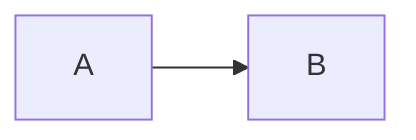

# markdown-editor
# Simple Markdown Editor with Image Folding (Base64)

このプロジェクトは、シンプルなMarkdownエディタです。次に機能を実現しています。
- **ブラウザだけで完結**する
- **画像をBase64で挿入し、編集の妨げにならないよう折りたたみ表示**する

---

## 🔧 特徴

- ✅ Markdownリアルタイムプレビュー（`marked.js`）
- ✅ Mermaid記法のプレビュー描画（`mermaid.js`）
- ✅ Base64形式で画像を挿入（ローカル画像選択）
- ✅ 編集エリアでは画像を**折りたたみ表示**（ファイル名表示のみに）
- ✅ プレビュー領域では画像を**展開して表示**
- ✅ HTML/CSS/JavaScript を分離した構造
- ✅ ブラウザのみで動作、インストール不要

---

## 📁 ファイル構成

```plaintext
markdown-editor/
├── index.html       # メインUI
├── style.css        # 見た目のスタイル定義
├── script.js        # 画像挿入や折りたたみ処理のJavaScript
└── README.md        # 本ファイル
```

---

## 🚀 使用方法

### 1. クローンまたはダウンロード

```
git clone https://github.com/your-repo/markdown-editor.git
cd markdown-editor
```

または、ZIPダウンロードして展開してください。

---

### 2. ブラウザで開く

`index.html` をダブルクリックするか、ブラウザで開いてください。

---

### 3. エディタ機能の使い方

| 操作                         | 説明                                           |
|------------------------------|------------------------------------------------|
| Markdownを入力              | 左側のテキストエリアに記述                     |
| プレビュー表示              | 右側にリアルタイムで反映                      |
| 画像挿入ボタンをクリック    | ローカル画像を選択                            |
| Base64挿入（自動）           | ファイル名と紐づいたBase64文字列をMarkdown形式で折りたたみ挿入 |

例（エディタ上）：

```markdown
<!-- image:cat.png -->
[画像: cat.png]
<!-- /image -->
```

プレビュー側では画像が展開されます。

---

### 4. Mermaid記法の例

Mermaidのフローチャートなどを描画するには、コードブロックの言語に `mermaid` を指定します。



---

## 📦 ライブラリ

- [marked.js](https://github.com/markedjs/marked)：MarkdownをHTMLに変換
- [mermaid](https://mermaid.js.org/)：Mermaid記法をSVGに変換

---

## 🧩 今後の拡張候補

- 画像の削除や再選択
- ダークモード対応
- Markdownの保存・読み込み（ローカルストレージ対応）
- エクスポート（HTML / PDF）

---

## 📄 ライセンス

MITライセンス
