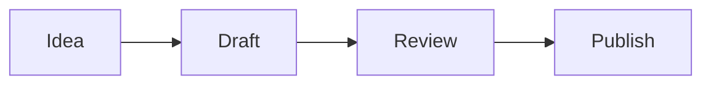

# Markdown Editor Blue

A browser-only Markdown editor focused on smooth writing and review workflows. It combines a distraction-free textarea, instant preview, diagram rendering, and convenient helpers so that you can prepare documentation without leaving your browser.

## ✨ Features at a glance
- **Live preview powered by [marked](https://github.com/markedjs/marked)** with synchronized scrolling between the editor and preview panes.
- **Mermaid diagram support** – fenced code blocks labelled `mermaid` render as diagrams and stay responsive.
- **Inline Base64 images with folded placeholders** – inserted images are stored in-memory and represented by a compact comment block in the editor while the preview expands them as `` tags.
- **Clickable task lists** – checking items in the preview updates the underlying Markdown.
- **Automatic table of contents panel** that tracks editor focus, highlights the current heading, and lets you jump around the document.
- **Drag-to-resize layout** for the table of contents, editor, and preview columns.
- **Built-in templates** for common documents such as meeting notes, release notes, and READMEs.
- **File operations without a backend** – open existing Markdown files, save edits locally, or print to PDF via the browser.
- **Contextual help window** containing Markdown and Mermaid cheat sheets.
- **Runtime language switcher** backed by the translations in `i18n/en.json` and `i18n/ja.json`.

## 📁 Project structure
```text
markdown-editor/
├── index.html            # Application shell and toolbar
├── style.css             # Layout and visual styling
├── script.js             # Editor logic, preview rendering, and UI behaviors
├── config.js             # Basic configuration (default language)
├── i18n.js               # Lightweight internationalisation helper
├── i18n/                 # Translation resources (English & Japanese)
├── template/             # Markdown templates selectable from the toolbar
├── images/               # Static assets (icons)
├── tests/                # Playwright end-to-end tests
└── package.json          # Test dependencies and scripts
```

## 🚀 Getting started
1. **Clone or download the repository.**
   ```bash
   git clone https://github.com/your-repo/markdown-editor.git
   cd markdown-editor
   ```
2. **Open `index.html` in your browser.**
   The application is completely static, so no build step is required.

> 💡 If you plan to run the automated tests, install dependencies first: `npm install`.

## 🖊 Using the editor
| Action | What happens |
| --- | --- |
| Type Markdown in the left pane | The right pane updates instantly with rendered HTML. |
| Scroll either pane | The other side keeps pace so you stay in context. |
| Click headings in the TOC | The preview scrolls to the heading and the editor selection follows. |
| Insert Image | Pick a local image to embed as Base64; the editor receives a folded placeholder block. |
| Toggle checkboxes in the preview | The matching task item in the Markdown source is toggled. |
| Choose a template | Replace the current document with a starter outline from `template/`. |
| Open / Save / Export PDF | Load Markdown from disk, download your work, or print the preview to PDF. |
| Export preview HTML | Download the rendered preview as a standalone HTML file. |
| Toggle the help window | Show or hide quick reference sheets for Markdown and Mermaid syntax. |

### Image placeholder example
```markdown
<!-- image:diagram.png -->
[Image: diagram.png]
<!-- /image -->
```
The preview resolves this block to the Base64 image you inserted, keeping the editor uncluttered.

### Mermaid diagrams
Create a fenced code block labelled `mermaid` to render diagrams:


## 🌐 Localization
The toolbar language selector updates the interface instantly. To add or adjust translations, edit the JSON files under `i18n/` and include matching keys for each language.

## 🧪 Development & testing
Playwright tests are provided to guard against regressions.
```bash
npm install       # first-time setup
npm test          # run end-to-end tests
```

## 📄 License
MIT License. See [LICENSE](./LICENSE) for details.
